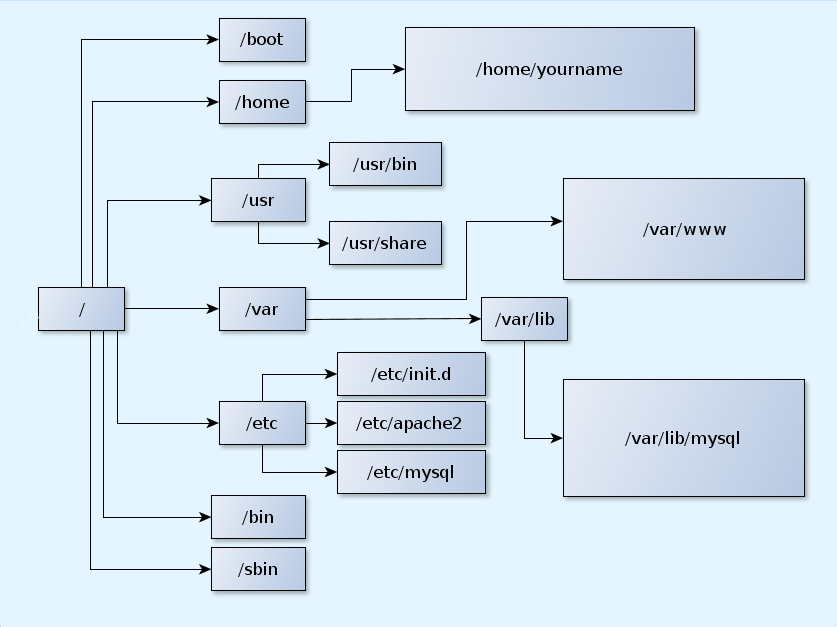

# Interface de línea de comandos


## Preámbulo

¡Vamos a conectarnos @ROGUE1!

1. Abre la terminal si estás en GNU/Linux o MacOSX o PuTTY si estás en Windows.

2. Conéctate a esta dirección IP:

```
192.168.105.221
```

  - En GNU/Linux y MacOSX teclea:

```
$ ssh <usuario>@castillo
```

o

```
$ ssh <usuario>@192.168.105.221
```

    
Teclea tu contraseña (parecerá que no se está escribiendo nada) y da enter de nuevo


  - En Windows abre PuTTY pon el IP en el campo que dice "Host Name (or IP address)" 
    - Clickea en "Open".  
    - Luego teclea tu nombre de usuario, da enter 
    - Teclea tu contraseña (parecerá que no se está escribiendo nada) y da enter de nuevo.

####¡Ya estas usando el Clúster del INMEGEN!

## ¿Qué es una linea de comandos?

La **[Interface de línea de comandos](http://en.wikipedia.org/wiki/Command-line_interface)** (CLI) es un **método para interactuar** con un programa o sistema operativo de computadora que permite al usuario dar órdenes al programa **en forma de lineas de texto** sucesivas (líneas de comando). 

La **CLI** es menos usada por el usuario de computadoras promedio que prefiere usar una **[Interface Gráfica de Usuario](http://en.wikipedia.org/wiki/Command-line_interface)** (GUI) que ofrece una estética mejorada y una mayor simplificación, a costa de un mayor consumo de recursos computacionales, y, en general, de una reducción de la funcionalidad alcanzable.

La **CLI**, sin embargo, es preferida por los usuarios avanzados de cómputo dado que ofrece medios más concisos y poderosos para controlar programas o sistemas operativos.

Las órdenes dadas al Shell de linea de comandos comúnmente tiene alguna de las siguientes sintaxis:

+ *hazAlgo -como archivoDestino*
+ *hazAlgo -como archivoFuente archivoDestino*
+ *hazAlgo -como <archivoEntrada> archivoSalida*
+ *hazAlgo -como | hazOtraCosa -como | hazAlgoMas -como > archivoSalida*

## Comandos básicos en UNIX

Copia y pega uno por uno los siguientes comandos mientras explico:


***ls*** (list) es un programa para listar el contenido de la carpeta en la que estamos "parados".

```
$ ls
```
```
$ ls -la
```
***cd*** (change directory) es un programa para cambiar de directorio dentro del árbol de directorios del sistema.

```
$ cd
```

***pwd*** (print working directory) es un pequeño programa que imprime en pantalla la ruta hacia el directorio donde estamos trabajando.

```
$ pwd
```

***find*** (encontrar) Es un programa que te muestra la estructura de archivos de la carpeta deseada y te permite filtrar el resultado para encontrar carpetas o archivos.

```
$ find
```

  - Comando para abortar una tarea `Ctrl` + `C`

```
$ find /
```


### Estructura de archivos

En los sistemas UNIX los archivos están organizados por directorios. Los directorios son archivos especiales que contienen información que permite localizar otros archivos en los dispositivos de almacenamiento. Los directorios pueden contener a su vez otros directorios los cuales se denominan subdirectorios. A la estructura resultante de esta organización se le conoce como *estructura de árbol invertido*.



   - Directorio raíz o *root* `/`: Es aquel directorio que está sobre todos los directorios. 

```
$ ls /
```
   
   - Directorio de coneccion `~`:  Es un directorio especial que representa el directorio principal de casa usuario. 

```
$ cd
$ cd ~
$ ls
$ cd /
$ ls ~
```

   - Directorio de trabajo `.`: El punto representa el directorio en el que estamos parados

```
$ ls .
```

   - Directorio superior `..`: Dos puntos representa el directorio arriba del que estamos parados

```
$ ls ..
$ cd ..
$ ls 
```


***mkdir*** (make directory) crea carpetas.

```
$ mkdir datos
```
```
$ cd datos
```
```
$ ls
```
***wget*** (www get) Es un programa para descargar archivos de internet.

```
$ wget https://raw.githubusercontent.com/hachepunto/GNU_Linux_connecting_tools/master/data/niklas_biomass_20040122.txt
```

wget es un poderoso programa con muchas opciones que pueden descubrir con  `man wget`.

```
$ ls
```
***cat*** (concatenate) sirve para concatenar archivos uno tras.

```
$ cat niklas_biomass_20040122.txt
```

***less*** es un paginador para ver archivos.

```
$ less niklas_biomass_20040122.txt
```
***man*** (manual) es un programa que muestra los manuales de los programas.

```
$ man less
```
Las páginas de manuales son documentación acerca de los comandos y programas que tiene el sistema. Tienen una estructura constante lo que nos ayuda a ubicar la información que necesitamos más facilmente.

```
$ less -S niklas_biomass_20040122.txt
```
***cut*** Corta por columnas un archivo.

```
$ cut -f1 niklas_biomass_20040122.txt
```
***pipe*** ( **|** ) es un método para encadenar programas de tal modo que la salida de uno es la entrada del que sigue. Se usa una barra vertical para separar los programas a usar.

```
$ cut -f1 niklas_biomass_20040122.txt | less
```
***sort*** ordena listas.

``` 
$ cut -f1 niklas_biomass_20040122.txt | sort | less
```
***uniq*** busca repetidos en una lista ordenada.

```
$ cut -f1 niklas_biomass_20040122.txt | sort | uniq |less
```

```
$ cut -f1,5 niklas_biomass_20040122.txt | sort | uniq |less
```
***wc*** (word count) cuenta el número de palabras y de renglones.

```
$ cut -f1,5 niklas_biomass_20040122.txt | sort | uniq | wc -l
```
```
$ cut -f1,5 niklas_biomass_20040122.txt | sort | wc -l
```
***>*** salva a archivo la salida estándar.

``` 
$ cut -f1,5 niklas_biomass_20040122.txt | sort | uniq > niklas_col_1_5_uniq.txt
```
```
$ less niklas_col_1_5_uniq.txt
```

***grep*** (get all lines matching the regular expression and print (g/re/p)) es un programa para buscar cadenas de texto dentro de un archivo.

```
$ grep Abies niklas_col_1_5_uniq.txt | less
```
```
$ grep Abies niklas_col_1_5_uniq.txt > abies.txt`
```


[Lista de comandos de UNIX en la Wikipedia](http://en.wikipedia.org/wiki/List_of_Unix_commands)

